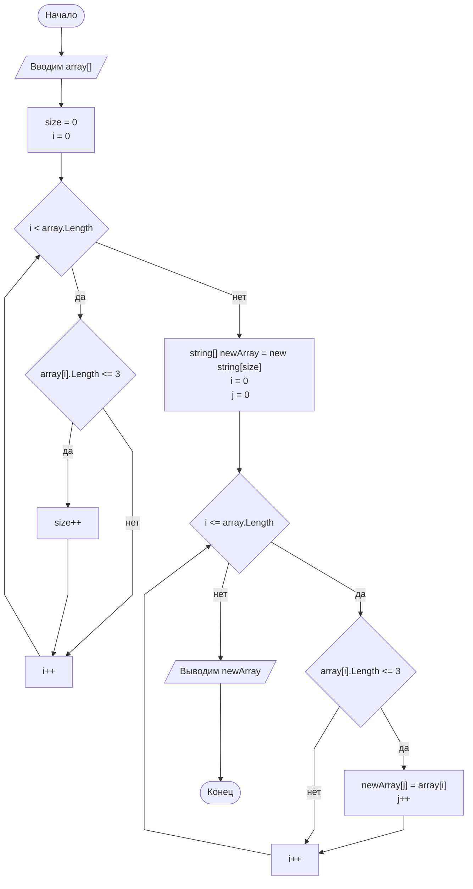

# Задача

Написать программу, которая из имеющегося массива строк формирует массив из строк, длина которых меньше либо равна 3 символа. Первоначальный массив можно ввести с клавиатуры, либо задать на старте выполнения алгоритма. При решение не рекомендуется пользоваться коллекциями, лучше обойтись исключительно массивами.

# Алгоритм решения

* Перебиранный заданный массив и вычисляем количество элементов с 3 и менее символов.
* Создаем новый массив с длинной равной количеству подходящих элементов.
* Записываем в новый массив все подходящие элементы заданного массива.
* Выводим новый массив

# Блок Схема
Чтобы смотреть в VSC в preview диаграммы нужно установить расширение [Markdown Preview Mermaid Support](https://marketplace.visualstudio.com/items?itemName=bierner.markdown-mermaid)

